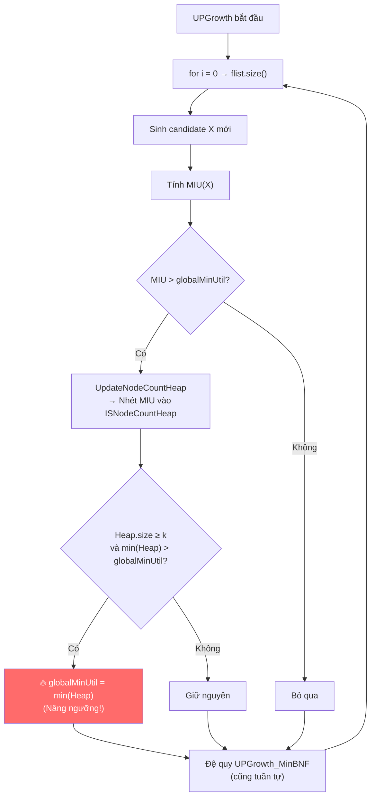

### Chi tiết về Chiến lược 3: MD (MIU of Descendents)

**Thời điểm áp dụng:** Ngay sau khi xây dựng trọn vẹn cấu trúc nhánh UP-Tree nhưng TRƯỚC KHI thuật toán bước vào quá trình duyệt đệ quy sinh Ứng viên (Pha 1).

**Mục tiêu:** Cố gắng "vắt kiệt" thông tin tổ hợp từ dạng nén của cây để thêm một lần nữa đẩy `min_util_Border` lên cao nhất có thể trước khi phải đi vào vòng lặp khai thác (rất tốn CPU/RAM).

**Bí quyết hoạt động của MD:**
Trong cấu trúc UP-Tree, một node cha $\alpha$ sẽ nối dọc rễ của nó xuống các sub-tree con cháu phía dưới (gọi là $\beta$). Bằng cách nhìn vào cách các node liên kết với nhau, ta có thể dễ dàng nhẩm tính được **TẦN SUẤT XUẤT HIỆN CHUNG (Support Count - $SC$)** của tập $\alpha \cup \beta$. 
Thay vì cắn răng quay lại quét kho CSDL để tính lợi nhuận thực sự, ta sẽ mượn số lần xuất hiện chung $SC$ này đem nhân với giá trị **Thấp nhất khả thi ($miu$)** của 2 món đó để cho ra một **Cận dưới chắc chắn** ($MIU$). Với nguyên lý quen thuộc, nếu cái cận dưới nghèo khổ này tình cờ vẫn to vượt trên `min_util_Border` cũ rích, thuật toán sẽ lấy cận dưới này đè lên thăng cấp cho cành cây mới.

**Ví dụ thực tiễn:**
Dựa trên hình cây UP-Tree đã vẽ và một bảng Giá Thấp Nhất (`miu`) cho từng sản phẩm:
Giả sử thuật toán xét Node cha là **`C`** (có $miu(C) = 1\$$). Nhìn xuống phía dưới Node C để gom các Node cháu đại diện cho **`A`** ($miu(A) = 5\$$).
- Đếm tổng trên cây, số lần A nằm dưới trướng C trên toàn hệ thống là `Count = 3`. (Tức là sự kết hợp $\{A, C\}$ lặp lại chung với nhau đúng 3 lần).
- Tính Cận dưới lợi nhuận cực tiểu (MIU) của bộ $\{A,C\}$:
  $$ MIU(\{A,C\}) = [miu(A) + miu(C)] \times Count = (5 + 1) \times 3 = \mathbf{18 \$} $$
*(Logic ở đây là: rẻ rách cùi bắp tận đáy xã hội, thì bộ đôi $\{A,C\}$ này cũng **chắc chắn** đem về 18đ vào két sắt)*.

Thuật toán sẽ âm thầm quét hằng hà sa số các cận $MIU$ này từ các mối tình Cha-Cháu trên cây, sau đó xếp hạng từ cao xuống thấp và khóa vào vị trí thứ ***k*** (vd: thu được con số đại diện 18 đ). Nếu `min_util_Border` tàng hình lúc đó mới lẹt đẹt ở mốc 10 đ, thì Bùm, nó sẽ được nâng thẳng lên mốc mới bằng 18 đ. Một cú thăng cấp này đủ để ra lệnh thảm sát băm nát hàng vạn nhánh con sau này chưa kịp nhú mà có Utility < 18 đ.

---

### Chi tiết về Chiến lược 4: MC (MUI of Candidates)

**Thời điểm áp dụng:** Hoạt động như một công nhân chạy ẩn dưới ngầm trong suốt Pha 1 - Lúc hàm UP-Growth đang nhào nặn đẻ liên tục ra các Candidates Ứng viên tiền năng ($PKHUI$).

**Mục tiêu:** Vừa chạy đẻ nhánh vừa track Cận cực tiểu liên tục để bóp hầu bao `min_util_Border` lên cao *theo thời gian thực* với tốc độ tên lửa, không cho nó nằm ì ạch tại chỗ chờ đến khi thuật toán quét xong.

**Bí quyết hoạt động của MC:**
Thuật toán nhặt một cái rổ phép thuật mang tên **`TopK-MIU-List`**, cài sẵn cấu trúc **Min-Heap** và chỉ giới hạn sức chứa đúng size $k$ (Ví dụ Top $k=3$ thì rổ chỉ nhét được 3 hòn đá).

Mỗi khi máy tính nhào nặn thành công ra một Tổ Hợp Ứng Viên $X$ mới (Ví dụ: đẻ ra chùm $\{Rau, Cá, Gạo\}$):
1. Nó đứng lại tính nhanh ngay $MIU(X)$ (Cận dưới tối thiểu) của tổ hợp vừa mới cất tiếng khóc chào đời này.
2. Kiểm tra điều kiện đầu vào, nếu $MIU(X)$ to lớn hơn mức xà `min_util_Border` hiện tại (và qua vài chỉ số an toàn khác) thì bứng nguyên cục $MIU(X)$ quăng thẳng vào rổ Min-Heap.
3. Nếu rổ chưa đầy $3$ cục đá, máy tính vẫn êm đềm thu nhận.
4. **NHƯNG NẾU** rổ đã bị nhét chật ních $3$ phân tử từ trước, thì tính phân cực của Min-Heap trỗi dậy: Nó đẩy phần tử có giá trị **BÉ NHẤT** trong rổ lên làm lớp trưởng (Vị trí đại diện thứ k-th). Trực giác sắc bén của thuật toán MC ngay lập tức lôi đầu lớp trưởng bé nhất rổ này ra để **Set đè ép cấp** ngầm cho `min_util_Border` toàn cục.

**Ví dụ thực tiễn:**
Trở lại với bài toán Top-3 $(k=3)$. `min_util_Border` của hệ thống hiện tại đang yên bình ở cột mốc $\mathbf{20}$.
Cái rổ Min-Heap hiện tại đang nằm chứa 3 hòn đá ngon lành: `[25, 30, 40]`.

Máy tính cày bừa đẻ ra một Ứng viên chùm $X$, tính toán ra được hòn đá có $MIU(X) = \mathbf{35}$. Số đá mới đẻ khá ngon, bự hơn ngưỡng 20 hiện tại. Ném bụp nó vào rổ!
Rổ chật trội bị đôn lên 4 cục vật thể: `[25, 30, 35, 40]`. Vi phạm định luật Size=3, rổ liền thẳng tay quăng cục đá yếu đuối nhất là **25** vào màn đêm vô định, bỏ lại 3 chiến thần `[30, 35, 40]`.

Lớp trưởng đội sổ mới của rổ lúc này nghiễm nhiên được nâng hạng có giá trị là **30**. Bằng một cú pháp đơn giản, thuật toán giáng đòn lấy con số **30** này áp sát và chém vỡ `min_util_Border` cũ (người tiền nhiệm 20). 
Ngưỡng sát thủ cắt tỉa toàn cục đã được ép lên $\mathbf{30}$! 

Việc nắn ngưỡng đánh úp sau lưng này tạo ra chấn động hủy diệt khôn lường tới toàn bộ các chùm Node rác chưa gieo xuống phía sau. Những tổ hợp đen đủi vốn được cho là có cơ sống sót sở hữu lượng máu $25, 28, 29$ vừa ló mặt chuẩn bị được sinh ra sẽ đập mặt thẳng vào bức thành $\mathbf{30}$ và lập tức vỡ vụn bị vứt thẳng vào thùng rác. Hàng tỉ dòng lê máy CPU I/O qua CSDL sau đó đã được lược hoàn toàn một cách mượt mà và mỹ mãn.

