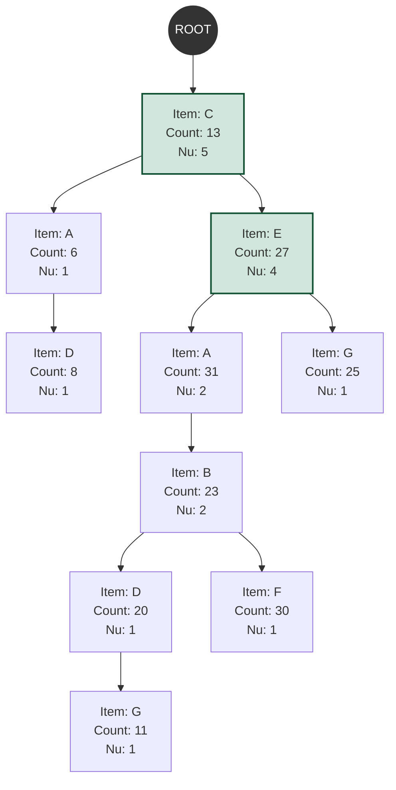

### 1. Ma trận cặp 2-phần tử (Pre-Evaluation Matrix - PEM) được chọn ra như thế nào?

Chiến lược **PE (Pre-evaluation)** dùng một ma trận 2 chiều tên là **PEM** để dự tính nhanh *cận dưới (lower bound)* lợi ích của các cặp 2 sản phẩm (2-itemsets) ngay trong lần **đọc dữ liệu đầu tiên (first database scan)**, qua đó ép ngưỡng ảo `min_util_Border` lên cao trước cả khi dựng cây.

**Bí quyết chọn cặp siêu nhanh:**
Bạn thử tưởng tượng nếu trong 1 biên lai có 100 món, nếu gom tất cả các tổ hợp chập 2 có thể có, ta phải tính $\frac{100 \times 99}{2} = 4950$ cặp. Việc này làm máy tính cực kỳ tốn thời gian.
Thay vào đó, thuật toán **chỉ lấy MẶT HÀNG ĐẦU TIÊN ($I_1$) trong giao dịch đó để bắt cặp với TẤT CẢ các mặt hàng đứng sau nó ($I_i$)**.

Công thức cộng dồn vào ô ma trận `PEM`:
$$PEM[I_1][I_i] = PEM[I_1][I_i] + EU(\{I_1, I_i\}, T_r)$$

**Ví dụ cụ thể từ bài báo:**
Xét hóa đơn $T_1 = \{(A,1), (C,1), (D,1)\}$ với lợi nhuận đơn vị $A=5, C=1, D=2$.
- Mặt hàng đầu tiên $I_1$ xuất hiện trong hóa đơn này là **`A`**.
- Các mặt hàng đứng sau là **`C`** và **`D`**.
- Thuật toán sẽ chỉ chọn tạo 2 cặp để tính: `{A, C}` và `{A, D}`. *(Nó cố tình lờ đi và bỏ qua cặp `{C, D}` tiết kiệm chi phí CPU).*

Trị giá chính xác của chúng trong $T_1$:
- $EU(\{A, C\}, T_1) = (1 \times 5) + (1 \times 1) = \mathbf{6}$. Số 6 sẽ được cộng dồn vào ô **`PEM[A][C]`**.
- $EU(\{A, D\}, T_1) = (1 \times 5) + (1 \times 2) = \mathbf{7}$. Số 7 sẽ được cộng dồn vào ô **`PEM[A][D]`**.

**=> Ý nghĩa thực tiễn:** Vì nó "ăn gian" không cộng tất cả mọi cặp có thể sinh ra trên đời, con số trong $PEM[X][Y]$ chắc chắn sẽ **nhỏ hơn hoặc bằng** lợi ích thực tế của bộ $\{X,Y\}$. Nó đã vô tình tạo ra một **Cận dưới hoàn hảo**. Bằng cách lấy giá trị cặp có Utility lớn thứ $k$ trong ma trận này đè lên `min_util_Border`, thuật toán đẩy nhanh ngưỡng gốc từ 0 lên an toàn tuyệt đối mà không sợ bỏ sát kết quả Top-K.

---

### 2. Visualize Cây UP-Tree trông như thế nào?

**UP-Tree** (Utility Pattern Tree) là một dạng cây tiền tố (Prefix Tree) thiết kế để nén hàng triệu dòng CSDL giao dịch vào chung vài nhánh nối nhau để bóp nhỏ vào thanh RAM, có cấu trúc giống hệt $FP-Tree$ nhưng được độ thêm để mang tải "trọng lượng" (Lợi nhuận - Node Utility).

**Quy tắc:**
Trước khi ném các giao dịch vào cây, các item trong một giao dịch phải được **Sắp xếp lại (Reorganized)** giảm dần theo độ lớn của $TWU$. Lấy Data ở ví dụ bảng 1 trong bài, độ lớn TWU của toàn bộ Database như sau:
**C (96) > E (88) > A (65) > B (61) > D (58) > G (38) > F (30)**.

Như vậy ví dụ với giao dịch ban đầu $T_1 = \{(A,1), (C,1), (D,1)\}$, nó phải được xếp lại thành $T_1' = \{(C,1), (A,1), (D,1)\}$. Các biên lai khác cũng vậy. Ai "quyền lực" (TWU cao) sẽ được xếp ra làm cội rễ dùng chung trên cùng.

**Cấu tạo 1 khối (Node) trên cây:**
Cây bắt đầu bằng 1 node `ROOT` rỗng ở đỉnh. Các node tự sinh cành mọc con xuống dưới. Một Node N sẽ có những thông tin:
- `Item`: Tên sản phẩm.
- `Count`: Số lượng giao dịch (hay nhánh gốc con) chạy qua vị trí nút này.
- `Nu` (Node Utility): Lợi nhuận của node ước tính tích lũy được tại vị trí chặn này.

🔥 **Sơ đồ Visualize Cây UP-Tree thông qua Mermaid:**
*(Mô phỏng lại Fig 1: A UP-Tree after inserting all the transactions in Table 1 trong bài)*

**Nhận xét:**
- Nhìn vào nút đầu tiên xanh dương **C:** Tên là C, `Count: 13` (có các tập dữ liệu tổng đếm 13 đi ngang qua nút này tính từ ROOT), `Nu: 5` (lợi ích ước tính tích lũy gán là 5).
- Tờ biên lai $T_1'$ sau khi sắp xếp `{(C,1), (A,1), (D,1)}` chính là đường dọc đầu tiên chạy dài từ `ROOT -> C -> A -> D`. 
- Giao dịch nào có chung dãy tiền tố mạnh (ví dụ đều đi qua C và E) sẽ sáp lại cùng nhau dùng chung cái cành `ROOT -> C -> E`, giúp số phần tử trên cây giảm đi một cách phi mã so với bảng DB truyền thống.
- Cột giá trị `Nu` đính trên các Node là thứ thuật toán sẽ dùng (bằng chiến lược NU - Node Utilities) để soi chiếu xem liệu nó có lọt top K không, nếu có thì nâng lập tức ngưỡng `min_util_Border` thần thánh lên thêm.
