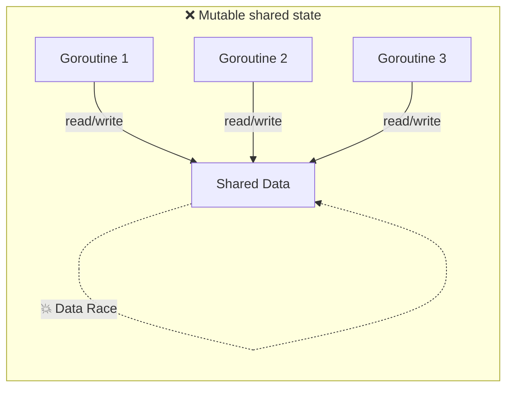
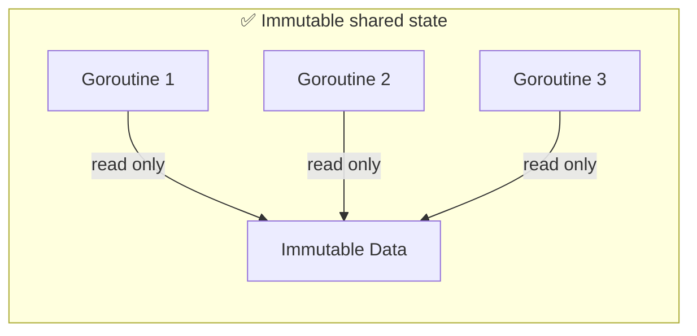
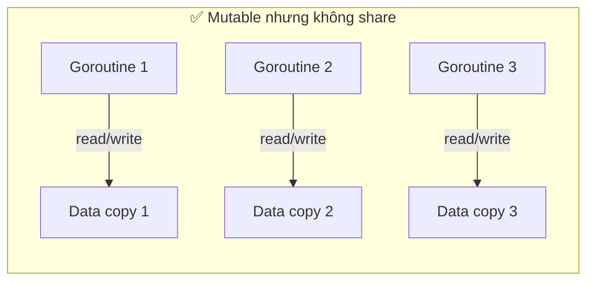
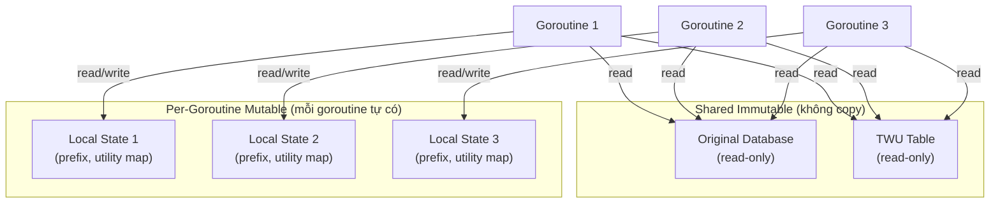
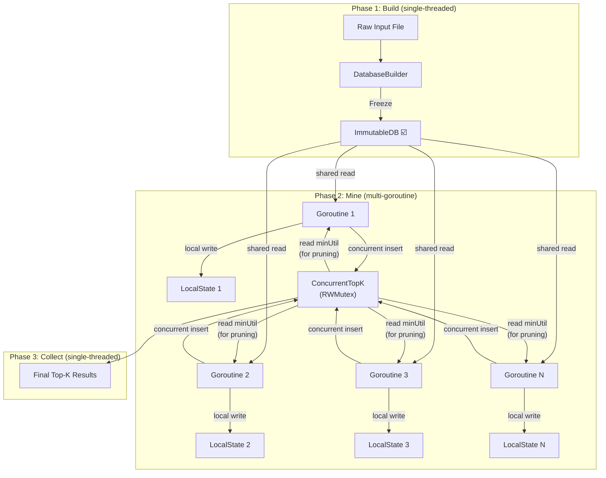

# Immutability & Song Song Hóa An Toàn trong Go

## 1. Tại sao Immutability quan trọng?

### Vấn đề gốc: Data Race

Khi 2+ goroutine **đọc và ghi đồng thời** vào cùng một vùng nhớ mà **không đồng bộ**, ta có **data race** — kết quả không xác định và rất khó debug.

```go
// ❌ DATA RACE
var counter int

go func() { counter++ }() // goroutine 1: đọc + ghi
go func() { counter++ }() // goroutine 2: đọc + ghi
// Kết quả: counter có thể = 1 hoặc 2 (không xác định)
```

### Quy tắc vàng

```
Nếu dữ liệu IMMUTABLE → nhiều goroutine đọc đồng thời = AN TOÀN
Không cần mutex, không cần channel, không cần đồng bộ.
```







> [!IMPORTANT]
> **2 cách tránh data race:**
> 1. **Share immutable data** — nhiều goroutine đọc cùng dữ liệu, không ai ghi
> 2. **Don't share mutable data** — mỗi goroutine có bản copy riêng

Đây chính là triết lý của Go: **"Don't communicate by sharing memory; share memory by communicating."**

---

## 2. Go không có `const struct` — Vậy làm thế nào?

Go **không hỗ trợ immutability ở cấp ngôn ngữ** (không có `const` cho struct, slice, map). Thay vào đó, ta dùng **các pattern thiết kế** để đạt được immutability.

### Bảng tổng hợp các kỹ thuật

| Kỹ thuật | Mức độ an toàn | Overhead | Phù hợp |
|---|---|---|---|
| Unexported fields + getter | Trung bình | Thấp | API design |
| Deep copy trước khi fork | Cao | Trung bình-Cao | Dữ liệu nhỏ-vừa |
| Copy-on-Write (COW) | Cao | Thấp (khi ít ghi) | Dữ liệu lớn, đọc nhiều |
| Value types (không pointer) | Cao | Trung bình | Struct nhỏ |
| Channel ownership transfer | Cao | Thấp | Pipeline pattern |
| Frozen pattern | Cao | Thấp | Build once, read many |

---

## 3. Kỹ thuật chi tiết + Code

### 3.1. Unexported Fields + Getter (Encapsulation)

Ẩn field, chỉ expose method đọc — không cho bên ngoài ghi.

```go
package itemset

// Transaction là immutable từ bên ngoài package
type Transaction struct {
    items     []int   // unexported → bên ngoài không ghi được
    utilities []int   // unexported
    tu        int     // transaction utility
}

// NewTransaction tạo transaction mới (copy dữ liệu vào)
func NewTransaction(items, utilities []int) Transaction {
    // Deep copy để caller không thể thay đổi internal state
    is := make([]int, len(items))
    us := make([]int, len(utilities))
    copy(is, items)
    copy(us, utilities)

    tu := 0
    for _, u := range us {
        tu += u
    }

    return Transaction{items: is, utilities: us, tu: tu}
}

// Getter methods — chỉ đọc, trả về copy
func (t Transaction) Items() []int {
    result := make([]int, len(t.items))
    copy(result, t.items)
    return result
}

func (t Transaction) TU() int {
    return t.tu // int là value type, tự copy
}

func (t Transaction) UtilityOf(item int) int {
    for i, it := range t.items {
        if it == item {
            return t.utilities[i]
        }
    }
    return 0
}
```

```go
// Sử dụng
tx := itemset.NewTransaction([]int{1, 3, 5}, []int{10, 20, 30})

// ✅ An toàn: nhiều goroutine đọc đồng thời
go func() { fmt.Println(tx.TU()) }()
go func() { fmt.Println(tx.Items()) }()

// ❌ Compile error: tx.items undefined (unexported)
// tx.items[0] = 999
```

> [!NOTE]
> **Lưu ý**: Getter trả về slice phải **copy** trước khi trả. Nếu trả thẳng `t.items`, caller có thể sửa internal state qua slice header.

---

### 3.2. Deep Copy trước khi Fork

Mỗi goroutine nhận **bản sao riêng** của dữ liệu → ghi thoải mái, không race.

```go
// Database cho TKU mining
type Database struct {
    Transactions []Transaction
    TWU          map[int]int // item → total weighted utility
}

// DeepCopy tạo bản sao hoàn toàn độc lập
func (db *Database) DeepCopy() *Database {
    newDB := &Database{
        Transactions: make([]Transaction, len(db.Transactions)),
        TWU:          make(map[int]int, len(db.TWU)),
    }
    copy(newDB.Transactions, db.Transactions)
    for k, v := range db.TWU {
        newDB.TWU[k] = v
    }
    return newDB
}

// Fork/Join với deep copy
func mineParallel(prefix []int, extensions []int, db *Database) []Result {
    if len(extensions) <= THRESHOLD {
        return mineSequential(prefix, extensions, db) // base case
    }

    mid := len(extensions) / 2
    leftExts := extensions[:mid]
    rightExts := extensions[mid:]

    var leftResults, rightResults []Result
    var wg sync.WaitGroup
    wg.Add(2)

    go func() {
        defer wg.Done()
        // ✅ Deep copy → goroutine này sở hữu hoàn toàn dbCopy
        dbCopy := db.DeepCopy()
        leftResults = mineParallel(prefix, leftExts, dbCopy)
    }()

    go func() {
        defer wg.Done()
        // ✅ Goroutine gốc giữ db gốc, hoặc cũng copy
        dbCopy := db.DeepCopy()
        rightResults = mineParallel(prefix, rightExts, dbCopy)
    }()

    wg.Wait()
    return append(leftResults, rightResults...)
}
```

> [!WARNING]
> **Nhược điểm**: Deep copy tốn bộ nhớ O(n) cho mỗi fork. Với database lớn và cây đệ quy sâu, memory sẽ **bùng nổ**. Chỉ phù hợp khi data nhỏ hoặc chỉ copy phần cần thiết.

---

### 3.3. Phân tách: Immutable Shared + Mutable Local

**Kỹ thuật quan trọng nhất cho TKU** — Chia dữ liệu thành 2 phần:



```go
// ===== IMMUTABLE: Chia sẻ giữa tất cả goroutine =====

// ImmutableDB chứa dữ liệu gốc, chỉ đọc sau khi khởi tạo
type ImmutableDB struct {
    transactions []Transaction // slice of value types
    twu          map[int]int   // item → TWU (ghi 1 lần lúc init)
    itemCount    map[int]int   // item → số transaction chứa nó
}

// Chỉ tạo 1 lần, sau đó chỉ đọc
func NewImmutableDB(rawData [][]int, utilities [][]int) *ImmutableDB {
    db := &ImmutableDB{
        twu:       make(map[int]int),
        itemCount: make(map[int]int),
    }

    for i, items := range rawData {
        tx := NewTransaction(items, utilities[i])
        db.transactions = append(db.transactions, tx)

        tu := tx.TU()
        for _, item := range items {
            db.twu[item] += tu
            db.itemCount[item]++
        }
    }

    return db // Sau dòng này, KHÔNG AI được ghi vào db nữa
}

// Chỉ có getter methods
func (db *ImmutableDB) GetTWU(item int) int   { return db.twu[item] }
func (db *ImmutableDB) TransactionCount() int  { return len(db.transactions) }
func (db *ImmutableDB) Transaction(i int) Transaction { return db.transactions[i] }

// ===== MUTABLE: Mỗi goroutine tự tạo riêng =====

// LocalMiningState chứa trạng thái tạm của mỗi nhánh tìm kiếm
type LocalMiningState struct {
    prefix        []int
    utilityMap    map[int]int   // item → utility tạm tính
    projectedTxs  []int         // index các transaction liên quan
}

// NewLocalState tạo state mới cho mỗi goroutine
func NewLocalState(prefix []int) *LocalMiningState {
    // Copy prefix để goroutine sở hữu riêng
    p := make([]int, len(prefix))
    copy(p, prefix)

    return &LocalMiningState{
        prefix:       p,
        utilityMap:   make(map[int]int),
        projectedTxs: make([]int, 0),
    }
}
```

```go
// ===== MINING: goroutine đọc shared DB, ghi vào local state =====

func mineBranch(db *ImmutableDB, state *LocalMiningState, topK *ConcurrentTopK) {
    // ✅ Đọc từ db (immutable, shared) — AN TOÀN
    for _, txIdx := range state.projectedTxs {
        tx := db.Transaction(txIdx) // trả về copy (value type)

        for _, item := range tx.Items() {
            // ✅ Ghi vào state.utilityMap (mutable, local) — AN TOÀN
            state.utilityMap[item] += tx.UtilityOf(item)
        }
    }

    // ✅ Ghi vào topK qua concurrent-safe method
    for item, utility := range state.utilityMap {
        candidate := append(state.prefix, item)
        topK.TryInsert(candidate, utility)
    }
}
```

> [!TIP]
> Đây là pattern **hiệu quả nhất**: Database lớn chỉ tồn tại 1 bản trong memory, mỗi goroutine chỉ tạo local state nhỏ. Tiết kiệm memory so với deep copy.

---

### 3.4. Concurrent-Safe Shared Mutable (khi bắt buộc phải share)

Một số dữ liệu **bắt buộc phải mutable và shared** — ví dụ Top-K heap trong TKU, vì tất cả goroutine cần cập nhật cùng 1 heap.

#### Cách 1: Mutex

```go
// ConcurrentTopK — thread-safe top-K heap
type ConcurrentTopK struct {
    mu       sync.RWMutex
    k        int
    minUtil  int
    items    []HeapItem
}

// TryInsert thêm itemset nếu utility đủ cao
func (tk *ConcurrentTopK) TryInsert(itemset []int, utility int) bool {
    // Fast path: đọc minUtil không cần lock exclusive
    tk.mu.RLock()
    if len(tk.items) >= tk.k && utility <= tk.minUtil {
        tk.mu.RUnlock()
        return false // Pruning sớm, không cần write lock
    }
    tk.mu.RUnlock()

    // Slow path: cần ghi
    tk.mu.Lock()
    defer tk.mu.Unlock()

    // Double-check sau khi lấy write lock
    if len(tk.items) >= tk.k && utility <= tk.minUtil {
        return false
    }

    // Copy itemset để tránh race
    is := make([]int, len(itemset))
    copy(is, itemset)

    tk.items = append(tk.items, HeapItem{Itemset: is, Utility: utility})
    // ... maintain heap, update minUtil
    return true
}

// GetMinUtility đọc ngưỡng hiện tại (dùng cho pruning)
func (tk *ConcurrentTopK) GetMinUtility() int {
    tk.mu.RLock()
    defer tk.mu.RUnlock()
    return tk.minUtil
}
```

#### Cách 2: Channel (Actor pattern)

```go
// TopK qua channel — không cần mutex
type TopKActor struct {
    insertCh chan InsertRequest
    queryCh  chan QueryRequest
    k        int
    minUtil  int
    items    []HeapItem
}

type InsertRequest struct {
    Itemset []int
    Utility int
    Reply   chan bool
}

type QueryRequest struct {
    Reply chan int
}

func NewTopKActor(k int) *TopKActor {
    actor := &TopKActor{
        insertCh: make(chan InsertRequest, 256), // buffered
        queryCh:  make(chan QueryRequest, 256),
        k:        k,
    }
    go actor.run() // Actor loop chạy trong 1 goroutine duy nhất
    return actor
}

// run — goroutine duy nhất truy cập state → không cần lock
func (a *TopKActor) run() {
    for {
        select {
        case req := <-a.insertCh:
            // Chỉ 1 goroutine (actor) ghi → an toàn
            inserted := a.tryInsertInternal(req.Itemset, req.Utility)
            req.Reply <- inserted

        case req := <-a.queryCh:
            req.Reply <- a.minUtil
        }
    }
}

// TryInsert — gọi từ bất kỳ goroutine nào
func (a *TopKActor) TryInsert(itemset []int, utility int) bool {
    reply := make(chan bool, 1)
    a.insertCh <- InsertRequest{Itemset: itemset, Utility: utility, Reply: reply}
    return <-reply
}

// GetMinUtility — gọi từ bất kỳ goroutine nào
func (a *TopKActor) GetMinUtility() int {
    reply := make(chan int, 1)
    a.queryCh <- QueryRequest{Reply: reply}
    return <-reply
}
```

> [!NOTE]
> **Mutex vs Channel cho TopK:**
> - **Mutex** nhanh hơn khi operation đơn giản và contention thấp
> - **Channel/Actor** clean hơn khi logic phức tạp, dễ reason about correctness
> - Trong TKU, **RWMutex với double-check** là lựa chọn tốt vì read (pruning check) nhiều hơn write (insert) rất nhiều

---

### 3.5. Frozen Pattern (Build → Freeze → Share)

```go
// DatabaseBuilder — mutable trong phase xây dựng
type DatabaseBuilder struct {
    transactions []Transaction
    twu          map[int]int
    frozen       bool
}

func NewDatabaseBuilder() *DatabaseBuilder {
    return &DatabaseBuilder{
        twu: make(map[int]int),
    }
}

func (b *DatabaseBuilder) AddTransaction(tx Transaction) {
    if b.frozen {
        panic("cannot modify frozen database")
    }
    b.transactions = append(b.transactions, tx)
    for _, item := range tx.Items() {
        b.twu[item] += tx.TU()
    }
}

// Freeze → trả về phiên bản immutable
func (b *DatabaseBuilder) Freeze() *ImmutableDB {
    b.frozen = true
    return &ImmutableDB{
        transactions: b.transactions, // transfer ownership
        twu:          b.twu,
    }
}
// Sau Freeze(), builder không dùng được nữa
// ImmutableDB chỉ có getter → chia sẻ an toàn giữa goroutine
```

---

## 4. Tổng hợp: Kiến trúc song song TKU hoàn chỉnh



```go
func RunTKUParallel(inputFile string, k int) []Result {
    // ====== Phase 1: Build (single goroutine) ======
    builder := NewDatabaseBuilder()
    for tx := range parseFile(inputFile) {
        builder.AddTransaction(tx)
    }
    db := builder.Freeze() // Immutable từ đây

    // ====== Phase 2: Mine (multi goroutine) ======
    topK := NewConcurrentTopK(k) // Shared mutable, thread-safe
    primaryItems := db.GetPrimaryItems()

    var wg sync.WaitGroup
    // Giới hạn concurrency
    sem := make(chan struct{}, runtime.NumCPU())

    for _, item := range primaryItems {
        // Pruning: kiểm tra TWU trước khi fork
        if db.GetTWU(item) < topK.GetMinUtility() {
            continue
        }

        wg.Add(1)
        sem <- struct{}{} // Acquire semaphore

        go func(rootItem int) {
            defer wg.Done()
            defer func() { <-sem }() // Release semaphore

            // ✅ Local state — mỗi goroutine tự tạo
            state := NewLocalState([]int{rootItem})
            state.projectedTxs = db.GetTransactionsContaining(rootItem)

            // ✅ db: shared immutable read
            // ✅ state: local mutable write
            // ✅ topK: shared mutable, thread-safe
            mineBranch(db, state, topK)
        }(item)
    }

    wg.Wait()

    // ====== Phase 3: Collect ======
    return topK.GetResults()
}
```

---

## 5. Checklist cho Song Song Hóa An Toàn

Mỗi khi bạn viết `go func()`, kiểm tra:

| # | Câu hỏi | Nếu "Có" |
|---|---------|-----------|
| 1 | Goroutine có **đọc** biến bên ngoài? | Biến đó phải immutable hoặc copy |
| 2 | Goroutine có **ghi** biến bên ngoài? | Dùng mutex/channel/atomic |
| 3 | Goroutine có capture **loop variable**? | Truyền qua parameter! |
| 4 | Slice/map có được **share** giữa goroutine? | Copy hoặc dùng concurrent-safe wrapper |
| 5 | Có cần **giới hạn số goroutine**? | Dùng semaphore (buffered channel) |

```go
// ❌ Lỗi kinh điển: capture loop variable
for _, item := range items {
    go func() {
        process(item) // BUG: tất cả goroutine dùng cùng 1 item
    }()
}

// ✅ Truyền qua parameter
for _, item := range items {
    go func(it int) {
        process(it) // OK: mỗi goroutine có copy riêng
    }(item)
}
```

> [!CAUTION]
> Luôn chạy test với `go test -race ./...` để phát hiện data race. Go race detector rất mạnh, nhưng chỉ phát hiện race **khi nó xảy ra** trong quá trình chạy test, không phải tất cả race tiềm ẩn.
