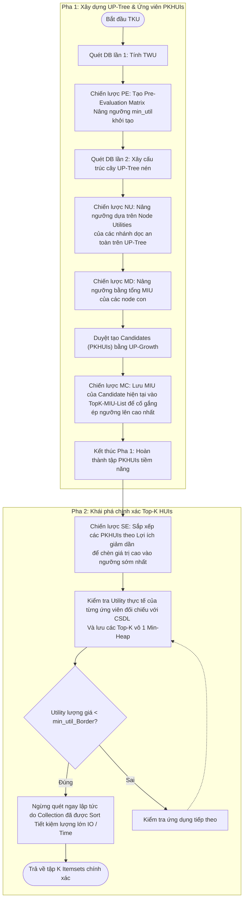
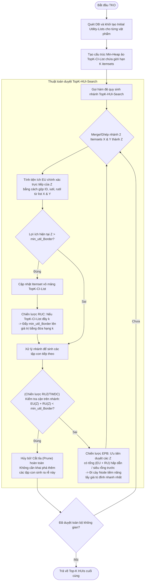

# Efficient Algorithms for Mining Top-K High Utility Itemsets

### 1. Ý tưởng cốt lõi của bài báo

Bài toán khai thác tập hữu ích cao (High Utility Itemsets - HUIs) truyền thống yêu cầu người dùng phải tự định nghĩa một ngưỡng tối thiểu `min_util`. Nếu đặt ngưỡng này quá thấp, thuật toán sinh ra vô số kết quả gây tràn RAM; nếu đặt quá cao, thuật toán trả về bằng 0.

Để giải quyết, bài báo chuyển bài toán sang dạng **Top-K High Utility Itemsets**: Khám phá đúng $k$ tập itemsets mang lại lợi ích cao nhất mà không cần truyền vào ngưỡng `min_util`. Hệ thống sẽ bắt đầu với ngưỡng ảo `min_util_Border = 0`, sau đó thông qua các chiến lược thông minh để **tăng dần ngưỡng này lên mức độ cao nhất và nhanh nhất có thể**. Ngưỡng ảo này càng cao, các nhánh phân tích không tiềm năng càng sớm bị cắt tỉa (prune), từ đó giúp thuật toán hội tụ và trả về kết quả cực kỳ hiệu quả.

Bài báo đề xuất 2 thuật toán là **TKU** (hai pha) và **TKO** (một pha).

---

### 2. Giải thích các công thức (Formulas)

Dưới đây là các định nghĩa và công thức toán học làm nền tảng kiểm tra và cắt tỉa (pruning) trong thuật toán:

*   **Utility của một Item ($EU(I_j, T_r)$)** - *Lợi ích tuyệt đối của 1 item:*
    $$EU(I_j, T_r) = P(I_j, D) \times Q(I_j, T_r)$$
    > **Giải thích**: Bằng Lợi nhuận đơn vị $P$ *(External utility)* nhân với Số lượng mua $Q$ *(Internal utility)* của mặt hàng $I_j$ trong một giao dịch cụ thể $T_r$.

*   **Utility của một Itemset ($EU(X)$)** - *Lợi ích thực tế của 1 tổ hợp mặt hàng:*
    $$EU(X) = \sum_{T_r \in D \wedge X \subseteq T_r} EU(X, T_r)$$
    > **Giải thích**: Lấy tổng lợi ích của một bộ $X$ xuyên suốt mọi giao dịch $T_r$ có chứa nó trong toàn bộ Database. Một itemset được coi là Top-k HUI nếu $EU(X)$ của nó thuộc top $k$ phần tử có giá trị cao nhất.

*   **$TWU(X)$ (Transaction-Weighted Utilization)** - *Cận trên cực đại dùng để cắt tỉa:*
    $$TWU(X) = \sum_{X \subseteq T_r \wedge T_r \in D} TU(T_r)$$
    > **Giải thích**: Là tổng của *toàn bộ lợi ích giao dịch* $TU(T_r)$ đối với mọi giao dịch có sự xuất hiện của tập $X$. Đây là **cận trên cực đại** của $EU(X)$. Quan trọng nhất, dựa theo lý thuyết TWDC: **Nếu $TWU(X) < min\_util_{Border}$, mọi tập mở rộng superset của $X$ chắc chắn sẽ rớt khỏi top-k**. Từ đó ta có thể hủy luôn, không cần duyệt nhánh của $X$.

*   **$MIU(X)$ (Minimum utility of an itemset)** - *Cận dưới dùng làm đòn bẩy nâng ngưỡng:*
    $$MIU(X) = \sum_{i=1}^M \min\{EU(I_i, T_r)\} \times SC(X)$$
    > **Giải thích**: Hàm này tìm giá trị thấp nhất của item mỗi khi xuất hiện trong database nhân với Support Count $SC(X)$ (Tổng số lượng giao dịch chứa nó). Đây là **cận dưới** (lower bound) đảm bảo $EU(X)$ trên thực tế chắc chắn lớn hơn $MIU$. Nhờ vậy, thuật toán an toàn dùng $MIU$ thành cột mốc thu hoạch để nâng ngưỡng `min_util_Border` lên mà khỏi sợ cắt lẹm mất kết quả thực tế.

*   **$MAU(X)$ (Maximum utility of an itemset)** - *Cận trên thực tiễn chặt chẽ (tight upper bounds):*
    $$MAU(X) = \sum_{i=1}^M \max\{EU(I_i, T_r)\} \times SC(X)$$
    > **Giải thích**: Lấy giá trị lớn nhất lịch sử của từng mặt hàng nhân với $SC(X)$. $MAU(X)$ cho ra một mức trần chặt chẽ hơn $TWU(X)$. Thuật toán dùng nó để lọc trước xem một itemset có đủ khả năng lọt top-k hay không.

---

### 3. Thuật toán TKU (Mining Top-k Utility Itemsets - Thuật toán 2 Pha)

**TKU** là một thuật toán **2 pha**. Ở *Pha 1*, thuật toán sinh ra danh sách các ứng viên tiềm năng (PKHUIs) trên cấu trúc nén `UP-Tree`. Ở *Pha 2*, bộ dữ liệu được lướt qua một lần nữa để vớt ra kết quả Top-k cuối cùng từ các ứng viên trên.

**Tổng hợp các chiến lược ép Thresholds của TKU**:
1. **PE (Pre-evaluation):** Ước giá trị ma trận cặp 2 phần tử lúc chạy lần quét đầu tiên ($TWU$).
2. **NU (Node Utilities):** Cập nhật dựa trên lợi ích nén dọc theo nhánh `UP-Tree`.
3. **MD (MIU of Descendents):** Tận dụng đồ thị dưới các node cha để tính cận dưới, ép thêm Threshold một lần nữa.
4. **MC (MUI of Candidates):** Track toàn bộ Min Utilities của Candidates đang được đẻ ra trên một mảng Min-Heap có k size, ép ngưỡng lên cao trần.
5. **SE (Sorting Exact Utility):** Mẹo lập trình tối ưu thời gian. Khi đem chấm điểm tính chính xác thực tế, Sort Candidates từ Giỏi đến Yếu $\rightarrow$ Chấm những Candidates mạnh là ra được bộ Utility cao, tiện tay chặn (prune) luôn các Candidates yếu sinh ra phía đuôi mà không cần tốn thời gian tính.

---

### 4. Thuật toán TKO (Mining Top-K utility itemsets in One phase - 1 Pha)

**TKO** là thuật toán thực tiễn hơn sử dụng trong **1 pha duy nhất** mà không sinh ra ứng viên nào nhờ thay thế cây UP bằng cấu trúc đọc dọc biểu diễn bộ nhớ cấp thấp là **Utility-List**. Nó tự động tính toán ra lợi ích thực để cắt tỉa qua mỗi lần chập cấu trúc.

**Tổng hợp chiến lược tăng tốc ở TKO**:
1. **RUC (Raising Threshold by Utility of Candidates)**: Cập nhật đè tức thời ngưỡng ảo lên giá hạng $k$-th nếu nhánh đang xét có kết quả tốt.
2. **RUZ (Reducing estimated utility values by using Z-elements)**: Lợi dụng thuộc tính nếu element đó không còn lợi ích tích trữ ($rutil = 0$), lập tức hạ lượng dự tính tương lai $EU+RU$ của nó cực nhanh. Việc hạ này gia tăng tốc độ thỏa mãn điều kiện Prune của thuật toán lên cực mạnh.
3. **EPB (Exploring the most Promising Branches first)**: Chiến lược sắp xếp thứ tự duyệt heuristic. Thay vì đi theo thứ tự ABC, TKO sắp xếp Node con với `Ước tính Lợi Tức` giảm dần $\rightarrow$ Đi theo nhánh có số tiền kỳ vọng to nhất trước $\rightarrow$ Hốt được top HUIs mạnh thật sự $\rightarrow$ Nâng $min\_util_{Border}$ lên vót trần siêu tốc $\rightarrow$ Từ đó quay ngược lại dập tắt toàn bộ các cụm nhánh le lói phía dưới ngay.
