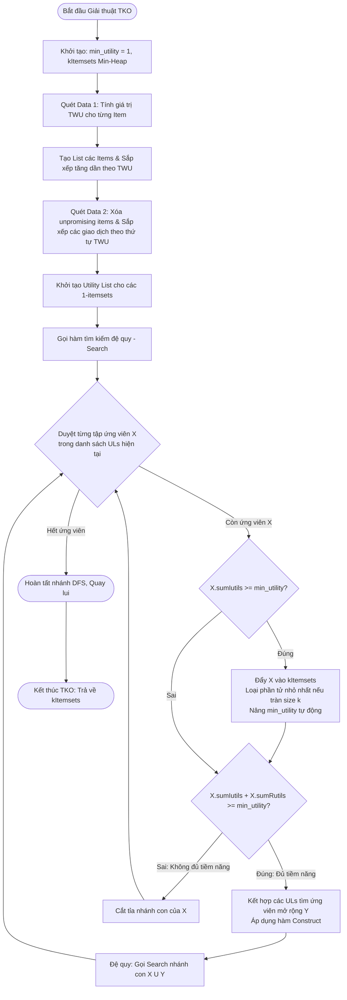
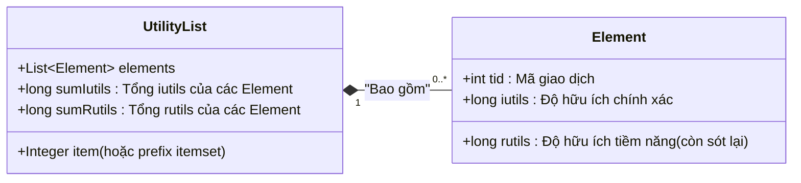
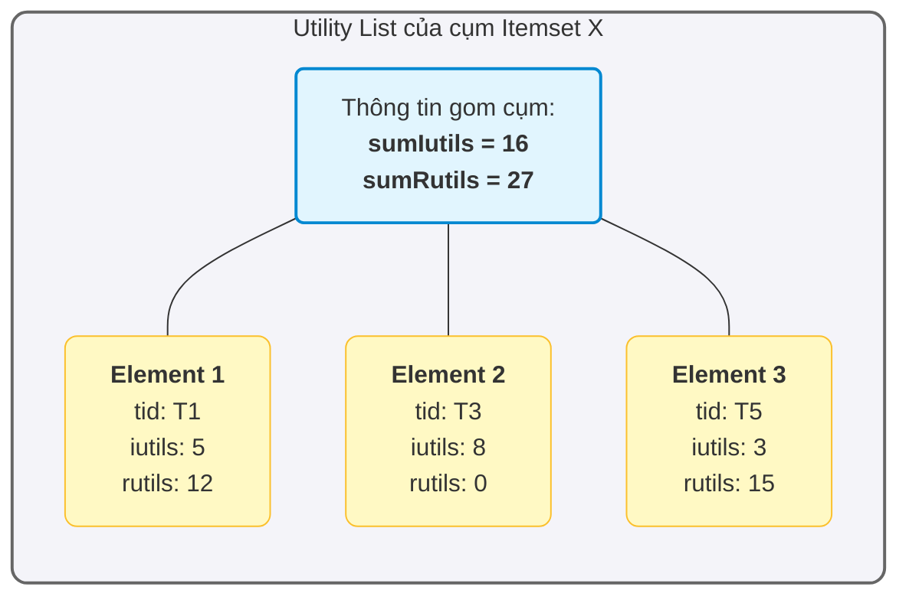

# Báo cáo Phân tích Khái quát Giải thuật TKO (Top-K High Utility Itemset in One phase)

## 1. Giới thiệu tổng quan (Algorithm Flow)

Thuật toán **TKO (Top-K in One phase)** giải quyết bài toán khai phá tập mục có độ hữu ích cao (High Utility Itemsets - HUI) thuộc loại Top-K. Điểm khó khăn lớn nhất của các bài toán HUI truyền thống là việc người dùng phải thiết lập một ngưỡng `min_utility` tĩnh một cách cảm tính (heuristic); nếu đặt quá lớn sẽ không tìm được kết quả, nếu đặt quá nhỏ thuật toán sẽ chạy quá lâu và bị tràn bộ nhớ do không gian tìm kiếm bị bùng nổ.

TKO giải quyết bằng cách:
- Bắt đầu với một ngưỡng `min_utility = 1` (hoặc `0`).
- T tự động duy trì và cập nhật linh hoạt ngưỡng này trong quá trình chạy (Dynamic Threshold Strategy) sử dụng mô hình **Hàng đợi ưu tiên (Priority Queue - Min Heap)** có độ dài giới hạn $k$. 
- Sử dụng cấu trúc lưu trữ gọn nhẹ **Utility List** (kế thừa từ HUI-Miner) để giữ lại mức độ hữu ích chính xác cũng như độ hữu ích tiềm năng dùng cho mục đích cắt tỉa (prune) không gian tìm kiếm với một pha duy nhất (One phase algorithm) không sinh ra tập các ứng viên dư thừa.

### Luồng xử lý chính của TKO:
1. **Quét dữ liệu lần 1:** Tính `TWU` (Transaction Weighted Utility) cho tất cả các item.
2. **Sắp xếp item:** Loại bỏ các unpromising item (rất hiếm trong TKO ở giai đoạn đầu) và sắp xếp các item theo thứ tự tăng dần của `TWU`.
3. **Quét dữ liệu lần 2:** Chuyển đổi các giao dịch (transactions) và tạo lập các **Utility List** cho các 1-itemsets (mỗi itemset đóng gói các thông tin `Utility`, `Remaining Utility`, và `Transaction ID`).
4. **Duyệt không gian tìm kiếm:** Duyệt đệ quy (DFS tree) kết hợp xây dựng Utility List cho các lớp k-itemsets từ $k-1$-itemsets.
5. **Cập nhật Top-K và Cắt tỉa:** Nếu gặp itemset có độ phổ biến thỏa mãn, đưa vào Min Heap. Nâng dần tự động cực tiểu biên `min_utility` và cắt tỉa nhánh cây dư thừa.

**Sơ đồ khối (Flowchart) tổng quát TKO:**


---

## 2. Chi tiết các Bước và Công thức Toán học

### Bước 1: Quét cơ sở dữ liệu lần 1 - Tính toán Transaction-Weighted Utilization (TWU)

**Công thức toán học:**
Độ hữu ích phần tử của một giao dịch $T_d$, ký hiệu $TU(T_d)$ là:
$$TU(T_d) = \sum_{x \in T_d} u(x, T_d)$$

Transaction-Weighted Utilization của một item $x$, ký hiệu $TWU(x)$ là:
$$TWU(x) = \sum_{x \in T_d \land T_d \in D} TU(T_d)$$

**Diễn giải:** 
TWU của một mã biểu trưng cho tổng mức độ hữu ích của tất cả các giao dịch mà mã này xuất hiện. TWU cung cấp tính chất "Monotonicity" (Tính đơn điệu/đóng) để có thể cắt tỉa (prune): Nếu $TWU(X) < min\_utility$, thì mọi tập không chứa $X$ cũng chắc chắn có độ hữu ích $< min\_utility$. 

**Pseudocode:**
```java
// Khởi tạo min_utility bắt đầu bằng 1
min_utility = 1
mapItemToTWU = Hash Map lưu trữ cặp <Item, TWU>

// Duyệt qua từng giao dịch T trong cơ sở dữ liệu:
for each transaction T in Database:
    TU_T = sum(u(i, T) for i in T)
    for each item i in T:
        mapItemToTWU[i] += TU_T

// Lọc và sắp xếp các item
listItems = get all items from mapItemToTWU
Sort(listItems, ascending by mapItemToTWU[item]) // Sắp xếp vật phẩm tăng dần theo TWU
```


### Bước 2: Quét cơ sở dữ liệu lần 2 - Xây dựng tập Utility List ban đầu (1-itemsets)

**Công thức toán học & Cấu trúc Dữ liệu:**
Mỗi Utility List của một tập mục $X$ chứa các phần tử liên kết (Elements). Mỗi phần tử biểu thị $X$ xuất hiện trong một giao dịch cụ thể ($T_{tid}$), chứa 3 thành phần thông tin sau:
- `tid`: Mã định danh giao dịch $T_d$
- `iutils` (Exact utility): Độ hữu ích chính xác của $X$ trong $T_{tid}$, $u(X, T_{tid})$
- `rutils` (Remaining utility): Tổng độ hữu ích của các phần tử xuất hiện **sau** vị trí của $X$ trong tập giao dịch (đã được sắp xếp theo TWU ở bước trước). Công thức:
  $$ru(X, T_{tid}) = \sum_{i \in T_{tid} \land i \succ X} u(i, T_{tid})$$

**Minh họa (Visualize) cấu trúc của Utility List:**





**Pseudocode:**
```java
mapItemToUtilityList = Hash Map lưu trữ cặp <Item, UtilityList>

// Trong quá trình duyệt Transaction thứ 2:
for each transaction T with id 'tid' in Database:
    // Sắp xếp các item trong T theo giá trị TWU của chúng tăng dần
    Sort(T)
    
    remainingUtility = total utility of T

    // Thiết lập element rutils cho từng item
    for each item x in T (in sorted order):
        remainingUtility = remainingUtility - u(x, T)

        Element e = new Element(tid)
        e.iutils = u(x, T)
        e.rutils = remainingUtility

        mapItemToUtilityList[x].addElement(e)
```


### Bước 3: Duyệt không gian tìm kiếm đệ quy (Hàm Search & Construct)

TKO đào tập không gian theo hướng Chiều sâu (DFS). Với một tập $pX$, nó đánh giá việc mở rộng $pX$ thành $pXY$.

**1. Tính toán giá trị biên (để xác lập HUI):**
Một tập $X$ được gọi là HUI trong kho chứa tạm nếu như:
$$X.sumIutils = \sum_{e \in X.UL} e.iutils \geq min\_utility$$

**2. Công thức Cắt tỉa (Pruning Strategy):**
Nếu tổng kỳ vọng tiềm năng của tập $X$ trong tương lai không thể đạt $min\_utility$, nó không đáng được duyệt:
$$\sum_{e \in X.UL} (e.iutils + e.rutils) < min\_utility \implies \text{Ngừng phần mở rộng cây từ } X$$

**3. Khấu trừ thông tin khi kết hợp Utility List (`Construct pXY`):**
Giả sử ta kết hợp 1 tập $pX$ và $pY$ (với điều kiện $Y$ đứng sau $X$ trong thứ tự TWU) để sinh ra Utility List cho $pXY$. Với mỗi yếu tố giao dịch có trong cả 2 danh sách (`tid`), phần tử $e_{XY}$ mới được hình thành như sau:

- Nếu $P = \emptyset$ (hợp 2-itemsets từ 1-itemsets gốc):
  - $e_{XY}.iutils = e_X.iutils + e_Y.iutils$
  - $e_{XY}.rutils = e_Y.rutils$
- Nếu $P \neq \emptyset$:
  - $e_{XY}.iutils = e_X.iutils + e_Y.iutils - e_P.iutils$ (Khấu trừ đi giao điểm $e_P$ để không đếm thừa)
  - $e_{XY}.rutils = e_Y.rutils$

**Pseudocode:**
```java
Function search(prefix, pUL, ULs):
    for i = 0 to ULs.size() - 1:
        UtilityList X = ULs.get(i)
        
        // 3.1. Cập nhật tập HUI và nâng ngưỡng Top-k (Xem bước 4)
        if X.sumIutils >= min_utility:
            writeOut(prefix + X.item, X.sumIutils)
        
        // 3.2. Cắt tỉa theo Pruning Condition
        if (X.sumRutils + X.sumIutils) >= min_utility:
            List<UtilityList> exULs = new ArrayList()
            
            // Xây dựng các nhánh con
            for j = i + 1 to ULs.size() - 1:
                UtilityList Y = ULs.get(j)
                UtilityList pXY = construct(pUL, X, Y) // Áp dụng công thức 3
                exULs.add(pXY)
                
            // 3.3. Đệ quy gọi vào nhánh cấp sâu hơn
            search(prefix + X.item, X, exULs)
```


### Bước 4: Chiến lược Tự động Cập nhật Ngưỡng Min-Utility (Dynamic Top-K Updating)

Trong lúc dò tìm HUI qua các lời gọi `search`, tập ứng viên Top-K sẽ liên tục bị biến động. `kItemsets` là một Min Heap (Phần tử ở đầu hàng đợi/root của tree luôn là đối tượng có Utility nhỏ nhất trong mảng Top K kết quả).

**Chiến lược hành vi:**
Mỗi khi có một $X$ có $Utility \geq min\_utility$:
- Thêm $X$ vào `kItemsets`.
- Nếu hàng đợi đầy (`size > k`), loại bỏ phần tử có mức Utility nhỏ nhất (`kItemsets.poll()`).
- Bắt đầu đẩy giới hạn $min\_utility$ mới lên bằng với giá trị phần tử nhỏ nhất hiện diện tại kIemsets. Mọi nhánh DFS tiếp theo sẽ sử dụng $min\_utility$ mới mạnh hơn (Khắc nghiệt hơn). Điều này giúp cắt tỉa cây không gian trạng thái với tốc độ cực kỳ nhanh ở giai đoạn giữa và cuối TKO.

**Pseudocode:**
```java
PriorityQueue<Itemset> kItemsets = new PriorityQueue(ordered by asc Utility)
int k = số lượng Top-K kết quả

Function writeOut(prefix, item, utility):
    Itemset itemset = new Itemset(prefix, item, utility)
    kItemsets.add(itemset) // Đẩy itemset mới vào Heap Tree
    
    // Nếu bị tràn queue
    if kItemsets.size() > k:
        // Cập nhật lại những người yếu nhất ra khỏi queue
        if utility > min_utility:
            while kItemsets.size() > k:
                kItemsets.poll() // Bóc node Root của Min Heap vứt đi
                
            // Tăng thanh gươm đo min_utility lên một mức mới
            min_utility = kItemsets.peek().utility 
```
