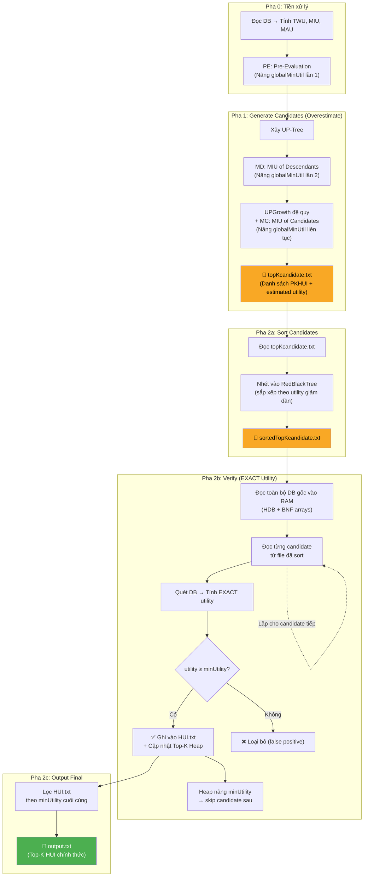
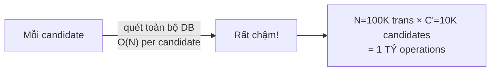
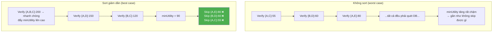

# TKU — Phân Tích Chi Tiết Pha 2 (Verification Phase)

## 1. Bức tranh toàn cục: Vị trí của Pha 2 trong TKU



> [!IMPORTANT]
> **Pha 1** sinh ra các **ứng viên (candidates)** với **estimated utility** (ước tính, overshoot thực tế).
> **Pha 2** là bước **xác minh** — quét lại database gốc để tính **exact utility** thực sự, loại bỏ các false positive.

---

## 2. Chi tiết từng bước trong mã nguồn Java

### 2.1. Bước trung gian: Sort Candidates

**Vị trí**: [AlgoTKU.java dòng 196–202](file:///Users/tuanla/Desktop/workspace/master/massive_data_sets/hui-problem/reference/src/ca/pfv/spmf/algorithms/frequentpatterns/tku/AlgoTKU.java#L196-L202)

```java
// Pha 1 output: topKcandidate.txt
// Nội dung ví dụ:
//   1 3 5:120    ← candidate {1,3,5} với estimated utility = 120
//   2 4:95       ← candidate {2,4} với estimated utility = 95
//   1 2 3:200    ← candidate {1,2,3} với estimated utility = 200

// Sort bằng RedBlackTree → sortedTopKcandidate.txt
// Kết quả (giảm dần theo utility):
//   1 2 3:200
//   1 3 5:120
//   2 4:95
```

**Mục đích sort giảm dần**: Candidate có estimated utility cao nhất sẽ được verify trước. Vì các candidate "mạnh" nhất thường cũng có exact utility cao → nhanh chóng đẩy `minUtility` lên cao → các candidate "yếu" phía sau sẽ bị skip sớm mà không cần quét DB.

### 2.2. Bước chính: Verify Exact Utility

**Vị trí**: [AlgoPhase2OfTKU.java dòng 74–159](file:///Users/tuanla/Desktop/workspace/master/massive_data_sets/hui-problem/reference/src/ca/pfv/spmf/algorithms/frequentpatterns/tku/AlgoPhase2OfTKU.java#L74-L159)

#### Bước 2.2.1 — Load toàn bộ Database vào RAM

```java
// dòng 88-95
ArrayList<Integer> HDB[] = new ArrayList[numberOfTransactions]; // items
ArrayList<Integer> BNF[] = new ArrayList[numberOfTransactions]; // utilities

initialization(HDB, BNF, HDB.length);
readDatabase(HDB, BNF, HDB.length, inputFilePath);
```

Database được load thành 2 mảng song song:
- `HDB[i]` = danh sách **item** trong transaction thứ `i`
- `BNF[i]` = danh sách **utility tương ứng** của từng item

```
Ví dụ: Transaction "2 3 5:18:3 6 9"
  HDB[0] = [2, 3, 5]     ← items
  BNF[0] = [3, 6, 9]     ← utility mỗi item
                           (item 2 có utility=3, item 3 có utility=6, item 5 có utility=9)
```

#### Bước 2.2.2 — Duyệt từng Candidate, quét DB tính Exact Utility

**Vị trí**: [AlgoPhase2OfTKU.java dòng 162–254](file:///Users/tuanla/Desktop/workspace/master/massive_data_sets/hui-problem/reference/src/ca/pfv/spmf/algorithms/frequentpatterns/tku/AlgoPhase2OfTKU.java#L162-L254)

```java
while ((CIR = bfr.readLine()) != null) {        // Đọc từng candidate
    String CI[] = CIR.split(":");                 // CI[0]="1 3 5", CI[1]="120"
    String candidate[] = CI[0].split(" ");        // candidate=["1","3","5"]

    // === SKIP SỚM ===
    if (Integer.parseInt(CI[1]) >= minUtility) {  // ← Nếu estimated utility < minUtility
                                                   //    → skip luôn, không cần quét DB!
        int EUtility = 0;                          // Exact Utility = 0

        // === QUÉT TOÀN BỘ DATABASE ===
        for (int i = 0; i < num_trans; i++) {      // Duyệt từng transaction
            if (HDB[i].size() != 0) {

                Match_Count = 0;
                int PUtility = 0;

                // Kiểm tra candidate có nằm trong transaction này không
                for (int s = 0; s < candidate.length; s++) {
                    if (HDB[i].contains(Integer.parseInt(candidate[s]))) {
                        Match_Count++;
                        int index = HDB[i].indexOf(Integer.parseInt(candidate[s]));
                        PUtility = PUtility + BNF[i].get(index);  // Cộng exact utility
                    } else {
                        PUtility = 0;
                        break;    // ← Item không tồn tại → bỏ transaction này
                    }
                }

                // Nếu TẤT CẢ items của candidate đều có mặt
                if (Match_Count == candidate.length) {
                    EUtility += PUtility;   // Cộng dồn utility từ transaction này
                }

            }
        }// End quét DB

        // === KIỂM TRA KẾT QUẢ ===
        if (EUtility >= minUtility) {
            // ✅ CANDIDATE NÀY LÀ HUI THẬT → ghi ra file
            Lbfw.write(CI[0] + ":" + EUtility);

            // Cập nhật Top-K Heap + có thể nâng minUtility
            updateHeap(Heap, CI[0], EUtility);
        }
        // ❌ Nếu EUtility < minUtility → False positive, loại bỏ
    }
}
```

#### Bước 2.2.3 — UpdateHeap: Tiếp tục nâng ngưỡng

**Vị trí**: [AlgoPhase2OfTKU.java dòng 292–309](file:///Users/tuanla/Desktop/workspace/master/massive_data_sets/hui-problem/reference/src/ca/pfv/spmf/algorithms/frequentpatterns/tku/AlgoPhase2OfTKU.java#L292-L309)

```java
void updateHeap(RedBlackTree<StringPair> NCH, String HUI, int Utility) {
    if (NCH.size() < theCurrentK) {
        NCH.add(new StringPair(HUI, Utility));       // Heap chưa đầy → thêm vào
    } else if (NCH.size() >= theCurrentK) {
        if (Utility > minUtility) {
            NCH.add(new StringPair(HUI, Utility));    // Thêm HUI mới
            NCH.popMinimum();                          // Đá phần tử yếu nhất ra
        }
    }

    // Nâng minUtility nếu phần tử yếu nhất trong heap > ngưỡng cũ
    if ((NCH.minimum().y > minUtility) && (NCH.size() >= theCurrentK)) {
        minUtility = NCH.minimum().y;                  // 🔥 Nâng ngưỡng!
    }
}
```

Cơ chế này **giống hệt MC ở Pha 1** — nhưng lần này dùng **exact utility** thay vì estimated.

#### Bước 2.2.4 — Lọc kết quả cuối cùng

**Vị trí**: [AlgoPhase2OfTKU.java dòng 108–137](file:///Users/tuanla/Desktop/workspace/master/massive_data_sets/hui-problem/reference/src/ca/pfv/spmf/algorithms/frequentpatterns/tku/AlgoPhase2OfTKU.java#L108-L137)

```java
// Đọc lại file HUI.txt (chứa TẤT CẢ HUI đã verify)
// Chỉ giữ lại những HUI có utility >= minUtility CUỐI CÙNG
while ((record = bfr1.readLine()) != null) {
    String temp[] = record.split(":");
    if (Integer.parseInt(temp[1]) >= minUtility) {     // ← Lọc bằng ngưỡng cuối
        bfw1.write(record);                             // Ghi vào output.txt
        numTopKHUI++;
    }
}
```

> [!NOTE]
> **Tại sao cần lọc lại?** Vì trong quá trình verify, `minUtility` liên tục được nâng lên. Những HUI ghi sớm (với exact utility thấp) có thể không còn đủ điều kiện sau khi ngưỡng đã tăng.

---

## 3. Ví dụ minh họa End-to-End

Giả sử Top-3 ($k=3$), `minUtility` từ Pha 1 = **50**.

### Input từ Pha 1 (sortedTopKcandidate.txt — đã sort giảm dần):

| # | Candidate | Estimated Utility |
|---|-----------|-------------------|
| 1 | {A,B,C}   | 200               |
| 2 | {A,D}     | 150               |
| 3 | {B,C}     | 120               |
| 4 | {C,D,E}   | 100               |
| 5 | {A,E}     | 80                |
| 6 | {B,D}     | 60                |
| 7 | {A,C}     | 55                |

### Quá trình Verify:

```
① Verify {A,B,C}: quét DB → Exact = 180 ✅ (≥ 50)
   Heap = [{A,B,C}:180], minUtility = 50

② Verify {A,D}: quét DB → Exact = 130 ✅ (≥ 50)
   Heap = [{A,B,C}:180, {A,D}:130], minUtility = 50

③ Verify {B,C}: quét DB → Exact = 90 ✅ (≥ 50)
   Heap = [{A,B,C}:180, {A,D}:130, {B,C}:90], minUtility = 50
   Heap đầy (size=3) → 🔥 minUtility = min(Heap) = 90

④ Verify {C,D,E}: estimated=100 ≥ 90 → cần verify
   quét DB → Exact = 110 ✅ (≥ 90)
   Heap thêm 110, đá 90 (B,C) ra → [{A,B,C}:180, {A,D}:130, {C,D,E}:110]
   🔥 minUtility = 110

⑤ Verify {A,E}: estimated=80 < 110 → ❌ SKIP! (không cần quét DB)

⑥ Verify {B,D}: estimated=60 < 110 → ❌ SKIP!

⑦ Verify {A,C}: estimated=55 < 110 → ❌ SKIP!
```

### Lọc cuối cùng (`minUtility` cuối = 110):

| HUI đã ghi vào HUI.txt | Exact Utility | Kết quả |
|---|---|---|
| {A,B,C} | 180 | ✅ ≥ 110 → Giữ |
| {A,D} | 130 | ✅ ≥ 110 → Giữ |
| {B,C} | 90 | ❌ < 110 → **Loại** (đã bị đá khỏi heap) |
| {C,D,E} | 110 | ✅ ≥ 110 → Giữ |

**Kết quả cuối cùng Top-3**: `{A,B,C}:180`, `{A,D}:130`, `{C,D,E}:110`

---

## 4. Độ phức tạp & Bottleneck

### Complexity Analysis

| Bước | Complexity | Ghi chú |
|---|---|---|
| Sort candidates | $O(C \cdot \log C)$ | C = số candidate, RedBlackTree insert |
| Load DB vào RAM | $O(N \cdot W)$ | N = số transaction, W = avg width |
| Verify 1 candidate | $O(N \cdot L)$ | L = length của candidate |
| Verify tất cả | $O(C' \cdot N \cdot L)$ | C' = số candidate thực sự verify (sau skip) |

### Bottleneck chính



> [!WARNING]
> **Pha 2 là bottleneck lớn nhất** của TKU vì:
> 1. Mỗi candidate phải quét **toàn bộ N transactions** (brute-force subset check)
> 2. `HDB[i].contains()` trên `ArrayList` là $O(W)$ — linear scan!
> 3. Không có index, không có bitmap, không có inverted index
> 
> Đây chính là điểm mà bạn có thể **tối ưu mạnh** trong bản Go:
> - Dùng **sorted array + binary search** thay `ArrayList.contains`
> - Dùng **bitset/bitmap** cho subset check
> - Dùng **inverted index** (item → []transactionID) để chỉ quét transaction liên quan
> - **Song song hóa**: verify nhiều candidates đồng thời bằng goroutines

---

## 5. Tại sao cần Sort giảm dần trước khi Verify?



**Sort giảm dần** đảm bảo:
- Candidates "mạnh nhất" được verify trước → `minUtility` tăng nhanh
- Candidates "yếu" phía sau bị skip mà không cần quét DB → **tiết kiệm rất nhiều thời gian**
- Trong ví dụ trên: skip 3/7 = **43% candidates** không cần verify

---

## 6. Tóm tắt: Pha 2 làm 4 việc

| Bước | Input | Output | Mục đích |
|---|---|---|---|
| **2a. Sort** | `topKcandidate.txt` | `sortedTopKcandidate.txt` | Ưu tiên verify candidate mạnh trước |
| **2b. Load DB** | File DB gốc | `HDB[]` + `BNF[]` in RAM | Chuẩn bị cho quét nhanh |
| **2c. Verify** | Sorted candidates + DB in RAM | `HUI.txt` (verified HUIs) | Tính exact utility, loại false positive |
| **2d. Filter** | `HUI.txt` + `minUtility` cuối | `output.txt` (Top-K HUI) | Lọc lần cuối bằng ngưỡng chính thức |
